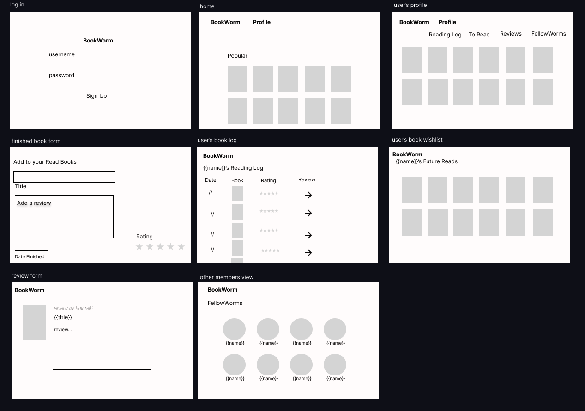
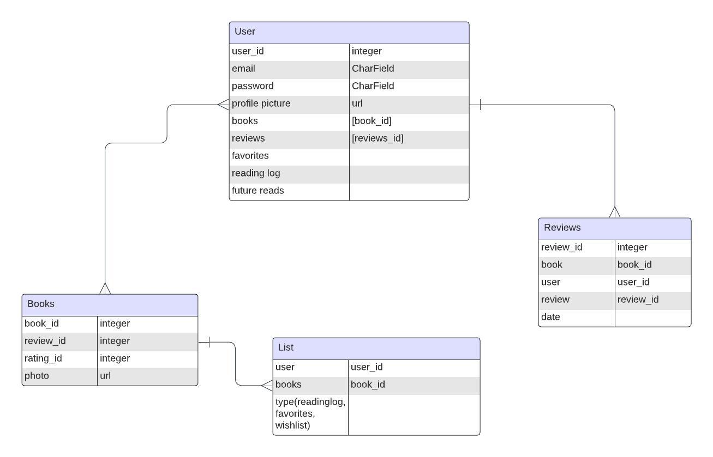
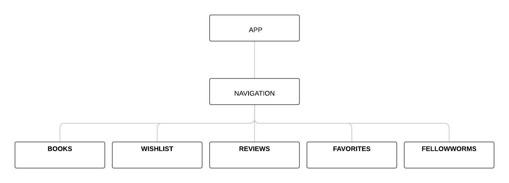

# BookWorm

With BookWorm you can catalogue your entire book collection, rate your reads and maintain a curated wishlist of books you want to dive into next. Share your thoughts and insights by writing reviews, and explore recommendations from fellow readers. Connect with book clubs in your area to join discussions with fellow book lovers. BookWorm is your conduit to a community of passionate readers!

## Developer
Noel Elias | [GitHub](https://github.com/eliaswnoel) 

## Technologies Used
React 
Django 
JavaScript 

## Wireframes

## Database ERD

## Component Hierarchy Diagram

## Post-MVP Ideas
- Implement 3rd Party API to have books already stored away
- Integrate Mapbox so user's can view bookclubs in your area

## Get BookWorm
Follow Production timeline through [Trello](https://trello.com/invite/b/M4RroajX/ATTI734987d0d983cc1549165104910675316F6B0809/bookworm-app)
